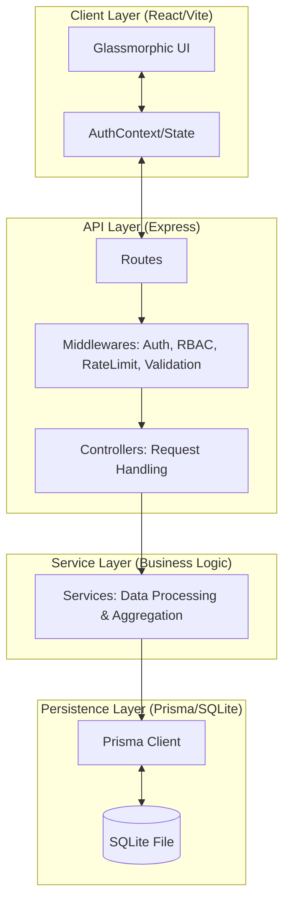

# 🌌 VaultFlow: Premium Finance Intelligence

VaultFlow is a professional-grade financial management platform designed for clarity, precision, and strategic insight. It features a sophisticated dark-mode aesthetic with glassmorphism, real-time data visualization, and a secure Role-Based Access Control (RBAC) architecture.

---

## 🏗️ System Architecture

The application follows a **Modular Monolith** architecture with a clear separation of concerns to ensure maintainability and scalability.



---

## 🔐 Security & Access Control (RBAC)

VaultFlow implements a strict **Identity & Access Matrix**. Every endpoint is protected by JWT authentication and granular role-based permissions.

| Feature | Endpoint | Viewer | Analyst | Admin |
| :--- | :--- | :---: | :---: | :---: |
| View Records | `GET /api/finance` | ✅ | ✅ | ✅ |
| Performance Summary | `GET /api/finance/summary` | ❌ | ✅ | ✅ |
| Create Records | `POST /api/finance` | ❌ | ❌ | ✅ |
| Modify/Delete Records | `PATCH/DELETE /api/finance/:id` | ❌ | ❌ | ✅ |
| Managed Users | `GET/PATCH/DELETE /api/users` | ❌ | ❌ | ✅ |

### Roles & Definitions
- **Admin**: Full system control. Can manage transactions, users, and view aggregations.
- **Analyst**: Focused on data insights. Can view records and executive summaries but cannot modify data.
- **Viewer**: Read-only access to individual records. No access to aggregated summaries or management tools.

---

## 💎 Evaluation Criteria Compliance

| Criterion | Implementation Detail |
| :--- | :--- |
| **1. Backend Design** | Modular structure: `Routes` → `Middlewares` → `Controllers` → `Services` → `Prisma`. |
| **2. Logical Thinking** | Enforced RBAC, soft-deletes for data safety, and efficient summary aggregations. |
| **3. Functionality** | Full CRUD for financial data, user management, and real-time dashboard updates. |
| **4. Code Quality** | Standardized naming, `AppError` centralized handling, and exhaustive JSDoc internal documentation. |
| **5. Data Modeling** | Optimized relational schema with indices for high-performance querying. |
| **6. Reliability** | Centralized **Zod Validation** for every input and **Rate Limiting** to prevent abuse. |
| **7. Documentation** | Comprehensive README, Mermaid diagrams, and clear API specifications. |
| **8. Additional Insight** | Premium Mesh-Gradient UI, Glassmorphism, and Framer Motion micro-interactions. |

---

## 🛠️ Technical Stack

- **Frontend**: React (Vite), Tailwind CSS, Framer Motion, Recharts.
- **Backend**: Node.js, Express, Prisma ORM, Zod, JWT.
- **Database**: SQLite (Local development for zero configuration).
- **Security**: Helmet (Headers), Cors, Express-Rate-Limit (custom), Bcryptjs.

---

## 🚀 Quick Start

### 1. Prerequisites
- Node.js (v18+)
- npm

### 2. Installation
```bash
# Install backend & frontend dependencies
npm install
cd client && npm install && cd ..
```

### 3. Environment Setup
Create a `.env` file in the root:
```env
PORT=3000
DATABASE_URL="file:./dev.db"
JWT_SECRET="vaultflow-premium-secret-2024"
NODE_ENV=development
```

### 4. Database Initialization
```bash
# Generate client & seed data
npx prisma generate
npx prisma migrate dev --name init
npm run seed
```

### 5. Launch
```bash
# Terminal 1: Backend
npm run dev

# Terminal 2: Frontend
cd client && npm run dev
```

---

## 🔐 Default Credentials (Seed Data)

| Role | Email | Password |
| :--- | :--- | :--- |
| **Admin** | `admin@vaultflow.com` | `admin123` |
| **Analyst** | `analyst@vaultflow.com` | `admin123` |
| **Viewer** | `viewer@vaultflow.com` | `admin123` |

---

## 📜 Assumptions & Tradeoffs

1. **SQLite for Persistence**: Chosen for local development convenience (zero-config). In production, the `DATABASE_URL` would point to PostgreSQL.
2. **Local Rate Limiting**: The current implementation uses in-memory tracking. For multi-instance production, a Redis-based limiter would be preferred.
3. **Soft Deletes**: Implemented to prevent accidental data loss, ensuring audit trails remain intact.
4. **Zod over Joi**: Selected for its superior TypeScript integration and concise syntax.

---

## 📜 License
VaultFlow Proprietary System. All rights reserved by Priyanshi Gupta.
